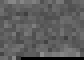
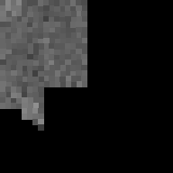
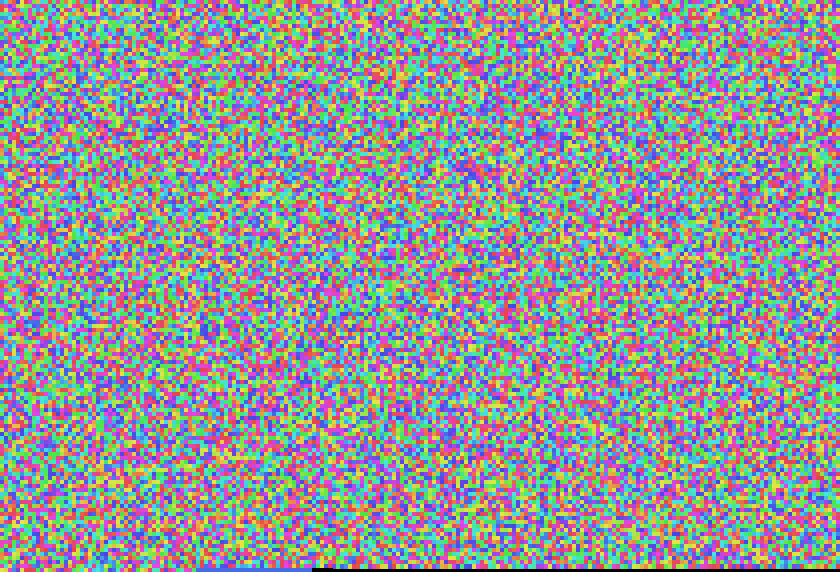
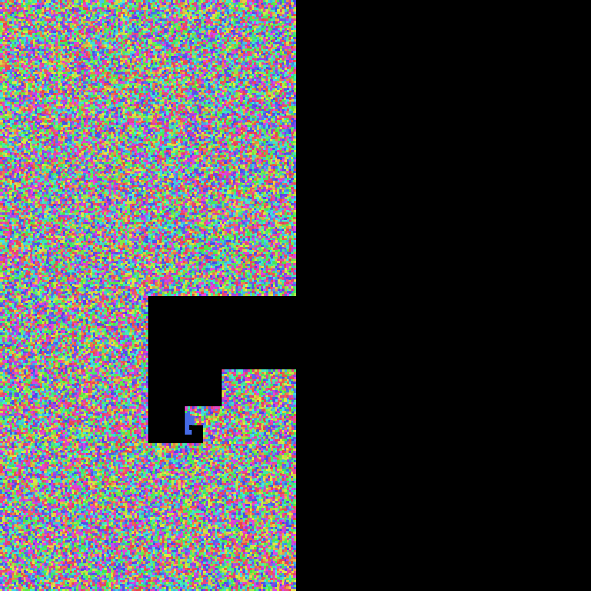

# When Hilbert earns its keep

Hilbert layout's selling point is **locality preservation**: sequence-adjacent positions stay image-adjacent. That property only matters when the thing you're coloring varies smoothly along the sequence. If you paint each base by identity (A/C/G/T), the image looks like random noise regardless of layout. But if you paint some *windowed statistic* or *k-mer identity*, Hilbert clusters similar values into blobs instead of spreading them across rows.

Both pairs below are SARS-CoV-2 (NC_045512.2, 29,903 bases).

## GC content per 100-bp window

### Raster


Each pixel = 1 window of 100 bases, brightness = GC%. Reads left-to-right, top-to-bottom. A GC-rich stretch becomes a horizontal streak; a GC-poor stretch becomes a darker patch, but spatially fragmented across rows.

### Hilbert


Same windows, same values — but regions of consistent GC content become coherent blobs in 2D rather than stripes. Easier to pick out where the sequence composition shifts.

## k-mer (6-mer) hash coloring

### Raster


Each pixel is colored by a hash of its surrounding 6 bases. Positions with the same 6-mer always get the same color, and visually distinct k-mers get visually distinct colors. Repeats and low-complexity regions show up as coherent colored blocks — and on raster, those blocks get sliced by row boundaries.

### Hilbert


Same k-mer hash colors. Repeat runs and low-complexity regions that occupied multiple rows in the raster image now sit together in 2D space. In particular, the poly-A tail at the end of the genome should look like a distinct cluster.

## Reproduce

```bash
seqpaint gc  --accession NC_045512.2 --output sarscov2_gc_w100.png         --window 100 --pixel-size 4 --aspect-ratio 3 2
seqpaint gc  --accession NC_045512.2 --output sarscov2_gc_w100_hilbert.png --window 100 --pixel-size 6 --layout hilbert
seqpaint fna --accession NC_045512.2 --output sarscov2_kmer6.png           --kmer 6 --pixel-size 4 --aspect-ratio 3 2
seqpaint fna --accession NC_045512.2 --output sarscov2_kmer6_hilbert.png   --kmer 6 --pixel-size 4 --layout hilbert
```
