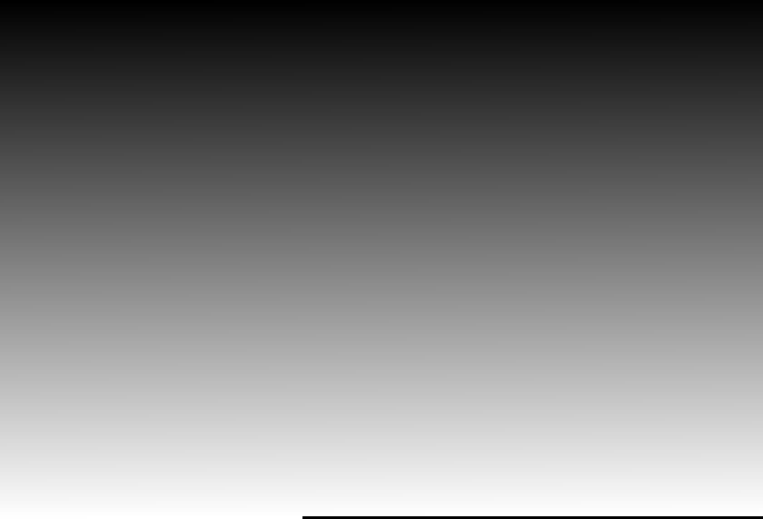
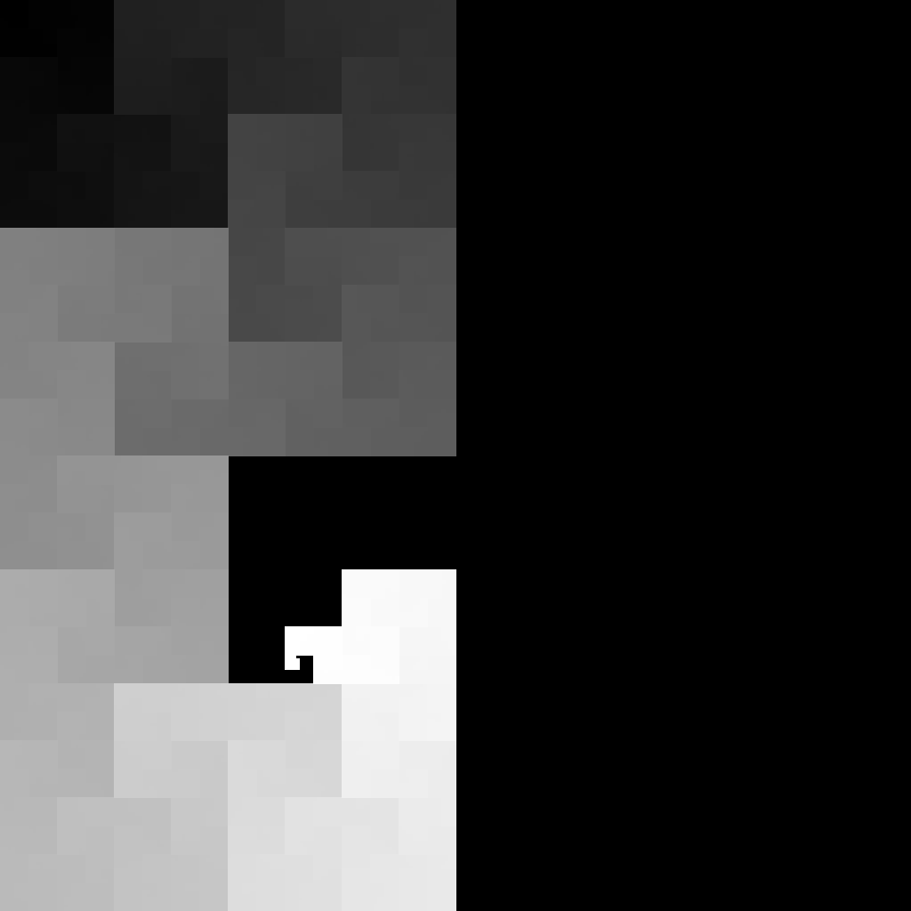

# Layouts: what they actually do

The three layouts differ in *how a linear sequence is unrolled onto a 2D image*. To make that difference visible without any biology getting in the way, these images color each pixel purely by its position along the sequence: black at the start, white at the end, smooth gradient in between. Same data, 29,903 positions (a SARS-CoV-2-sized sequence), three layouts.

## raster



Left-to-right, top-to-bottom. The gradient sweeps horizontally; adjacent rows restart the scan. Simple but breaks sequence-neighborhood: position 5000 and position 5001 sit next to each other only if they happen to be on the same row.

## Hilbert (space-filling curve)



The Hilbert curve folds the sequence into 2D while keeping nearby-in-sequence positions nearby in the image. You can see the curve's actual path here as a smooth, continuous gradient. This is the property that pays off when you're coloring some biological signal (GC content, k-mer identity): regions that vary slowly along the sequence become coherent blobs instead of stripes.

## Z-order (Morton curve)


Same locality-preserving idea as Hilbert, but using bit-interleaving. Produces discrete Z-shaped blocks — less smooth than Hilbert, but cheaper to compute. The gradient is visibly blocky rather than flowing.

## When the layout matters

- **Painting individual bases (A/C/G/T) directly**: layout doesn't help. Adjacent bases in a genome are essentially independent, so every image ends up looking like speckled noise regardless. Don't waste Hilbert on per-base coloring.
- **Painting windowed statistics (GC content, entropy) or k-mer hashes**: layout matters a lot. See [`../hilbert/`](../hilbert/) for a real biological example.

## Reproduce

```python
from pathlib import Path
from seqpaint.core import paint_values

vals = [i / 29902 for i in range(29903)]
paint_values(vals, pixel_size=4, aspect_ratio=(3, 2)).save("teach_position_raster.png")
paint_values(vals, pixel_size=4, layout="hilbert").save("teach_position_hilbert.png")
paint_values(vals, pixel_size=4, layout="zorder").save("teach_position_zorder.png")
```
