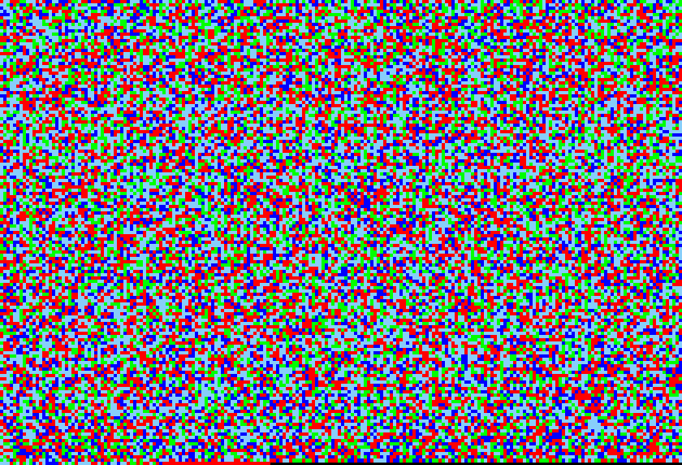
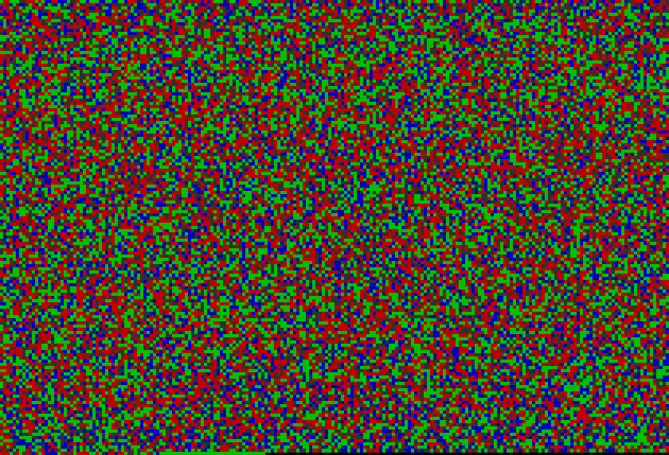
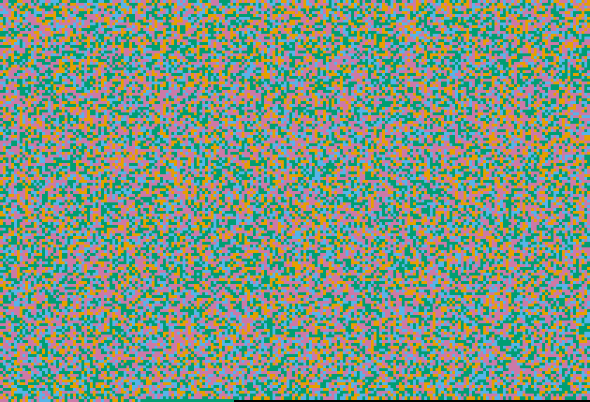

# Palettes

All four named palettes rendering the same input: SARS-CoV-2 genome (NC_045512.2, 29,903 bases), raster layout, pixel-size 4, aspect ratio 3:2.

## default



Saturated, maximally distinct colors — A=red, G=green, C=blue, T=sky blue, N=white. Optimized for visual distinctness between bases; not designed for color-deficient viewers.

## nature



IGV-inspired biology palette — A=green, C=blue, G=near-black, T=red. Familiar to anyone who uses the Integrative Genomics Viewer; matches common publication conventions.

## colorblind-safe



Okabe–Ito palette: bluish-green, sky blue, orange, reddish-purple. Designed to remain distinguishable across the most common forms of color vision deficiency (deuteranopia, protanopia, tritanopia).

## grayscale


Four shades of gray — useful for print, black-and-white figures, or when you want colors to not compete with an annotation overlay.

## Reproduce

```bash
for p in default nature colorblind-safe grayscale; do
  seqpaint fna --accession NC_045512.2 --output sarscov2_raster_$p.png \
    --palette $p --pixel-size 4 --aspect-ratio 3 2
done
```

The amino-acid palettes use the same names but different color tables — `nature` groups residues by chemical property class, `colorblind-safe` uses an Okabe–Ito-derived set for property classes, etc. See `seqpaint faa --help` for amino usage.
