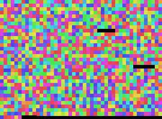

# Single-sequence examples

Small, focused renderings of individual biological sequences.

## *E. coli* 16S ribosomal RNA, k-mer coloring



NR_024570.1, 1450 bases. Raster layout, 5-mer hash coloring, pixel-size 6. 16S rRNA is a deeply conserved molecule used for species identification; its variable regions are separated by universally conserved stretches, and the k-mer coloring makes that alternation visible.

## Human mitochondrial genome, k-mer coloring

### Raster


NC_012920.1, 16,569 bases. 6-mer hash coloring. The ~1.1 kb D-loop / control region shows a different k-mer profile than the protein-coding and rRNA regions that make up the rest of the genome.

### Hilbert


Same data, Hilbert layout. Same pattern but the D-loop and the tRNA-punctuated coding genes become more spatially coherent.

## Bacteriophage lambda, GC content


NC_001416.1, 48,502 bases. GC% over 200-base windows, raster, aspect 3:2. Lambda's genome famously has distinct GC-content regions reflecting its modular life-cycle gene organization (left arm: packaging and head; middle: lysogeny; right arm: DNA replication and lysis).

## Reproduce

```bash
seqpaint fna --accession NR_024570.1 --output ecoli_16s_kmer5.png       --kmer 5 --pixel-size 6 --aspect-ratio 3 2
seqpaint fna --accession NC_012920.1 --output humanmito_kmer6.png       --kmer 6 --pixel-size 4 --aspect-ratio 3 2
seqpaint fna --accession NC_012920.1 --output humanmito_kmer6_hilbert.png --kmer 6 --pixel-size 6 --layout hilbert
seqpaint gc  --accession NC_001416.1 --output lambda_gc.png             --window 200 --pixel-size 4 --aspect-ratio 3 2
```
